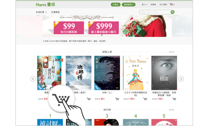
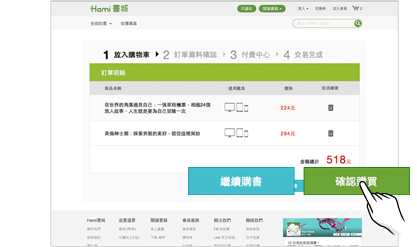
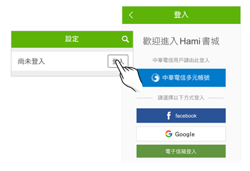

# 如何購買電子書

## 如何購買電子書？

❶ 於Hami書城選購您喜愛的電子書，選擇好您要購買的書籍後，點選購物車按鈕。

&#x20;

❷ 購買的書籍會放入購物車中，您可選擇繼續購書或確認購買。

&#x20;

❸ 結帳時會請您登入書城會員帳號，登入後將至付款頁面。

&#x20;

❹ 選擇付款方式並完成付款後，該電子書會自動置入您的雲端書單裡面。

<figure><figcaption></figcaption></figure>

注意事項：行動小額付款僅限自然人使用，因認證端需輸入手機設備號及證號。

2023／02／15起，<mark style="color:red;">公司門號無支援電信帳單付款購買電子書</mark>。中華電信個人門號用戶，若選擇電信帳單付款，請開通「小額付款」功能。
