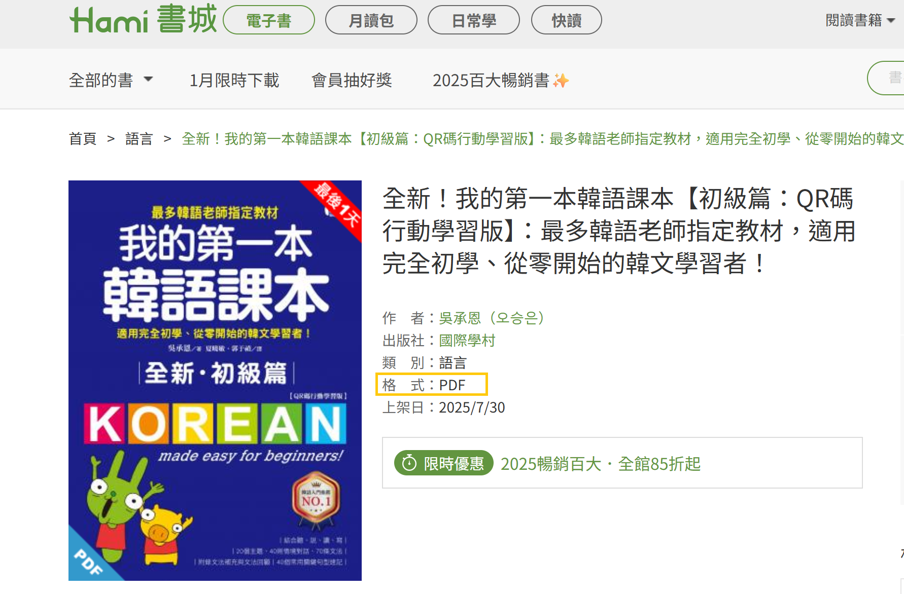
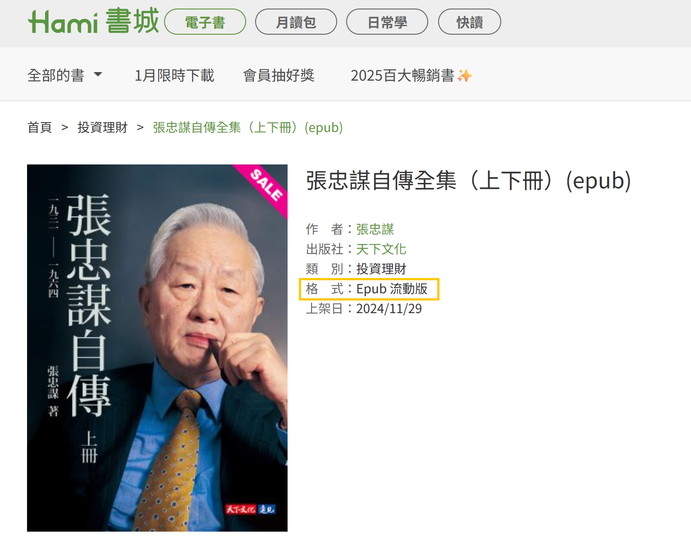
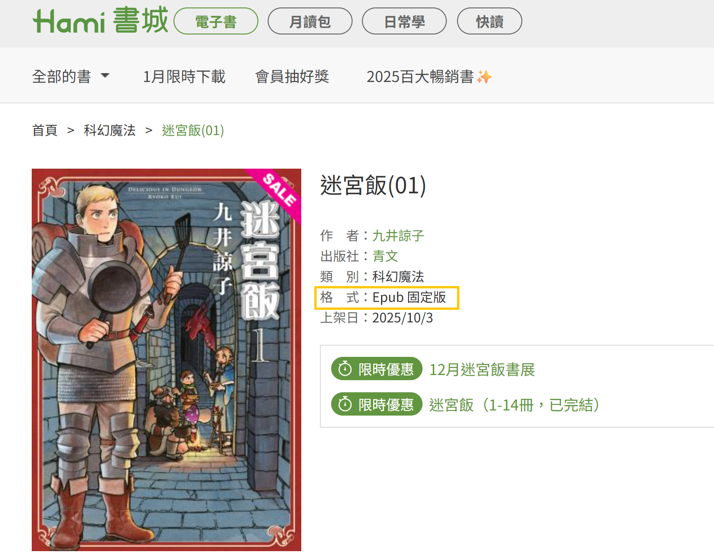

# 電子書格式？

Hami書城站內銷售之電子書為數位內容產品，需使用 HamiBookAPP進行閱讀，且不適用七日鑑賞期。請確認您已瞭解本服務方式再進行交易付款。

於Hami書城銷售之電子書格式，分為三項格式，標示於書籍簡介頁面，請於購買前確認您的購買格式。

❶PDF格式：

呈現方式為圖文排列。透過HamiBookAPP閱讀版面，調整放大/縮小，如同圖片縮放功能，請以雙指放大該頁面左右滑動閱讀。<mark style="color:red;">**於Hami書城購買PDF格式電子書，並非提供PDF電子檔案，無法使用Adobe Acrobat開啟。**</mark>

<figure><figcaption></figcaption></figure>

❷ePub 流動版：

依據裝置不同，顯示頁面文字排列行數不同，以文字閱讀為主。

HamiBookAPP閱讀版面放大/縮小，請點擊閱讀頁面，開啟「工具列」，用戶可於HamiBookAPP內調整「字型」､「橫排直排設定」､「行距設定」､「文字大小」。

<figure><figcaption></figcaption></figure>

❸ePub 固定版：

<figure><figcaption></figcaption></figure>

※注意事項：

電子書購買後，不受時間限制於HamiBookAPP/Hami書城官網PC閱讀。已購買之電子書內容，不受是否訂購月讀包服務影響。

<mark style="color:red;">**無支援另行匯出書籍電子檔案功能，亦無法使用其他程式開啟電子書閱讀。**</mark>

