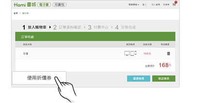
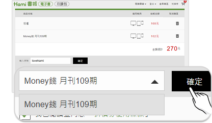
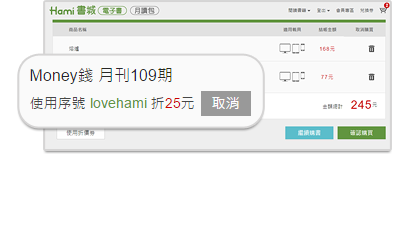

# 如何使用折價券序號？

折價券不可與優惠促銷價書籍併用。一次交易限抵用一組折價券序號。若為活動所指定品項的折價券，則需符合活動條件才可使用。若是指定致贈給您的折價券，折價券皆恕無法折現。

❶   於購物車中點擊「使用折價券」按鈕。

&#x20;

❷   於文字框中輸入您取得的折價券序號，按下「確定」，並且勾選「我已閱讀並同意『折價券使用條款』」。

&#x20;

❸    購物車中若有超過1個品項的商品，可指定要抵扣於何項商品中。於下拉選單中選擇要折抵的書籍，按下「確定」。

&#x20;

❹    成功折抵會顯示優惠後的金額，即可進行結帳流程。您也可點擊「取消」，日後選購電子書時再使用折價券。

&#x20;
