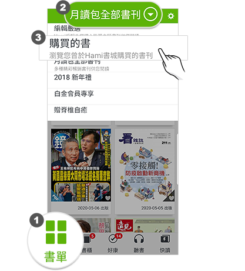
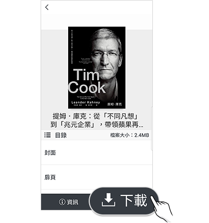
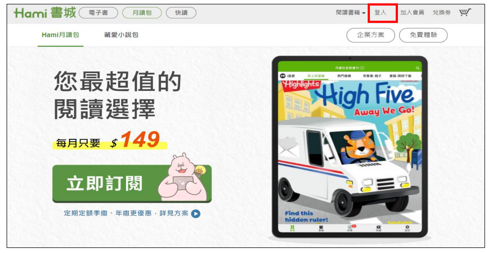
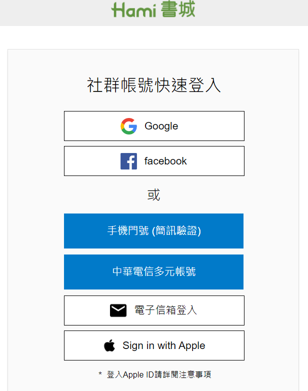
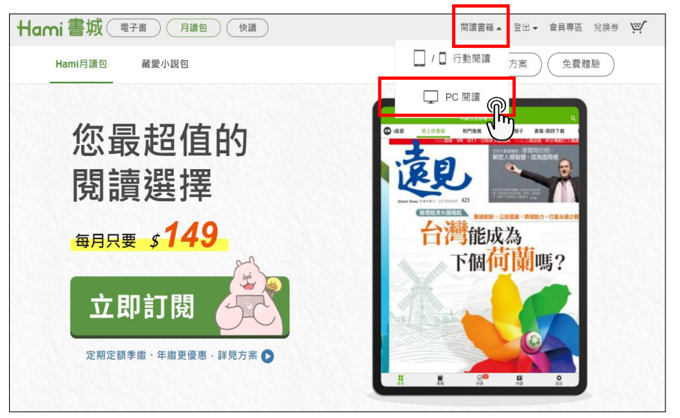
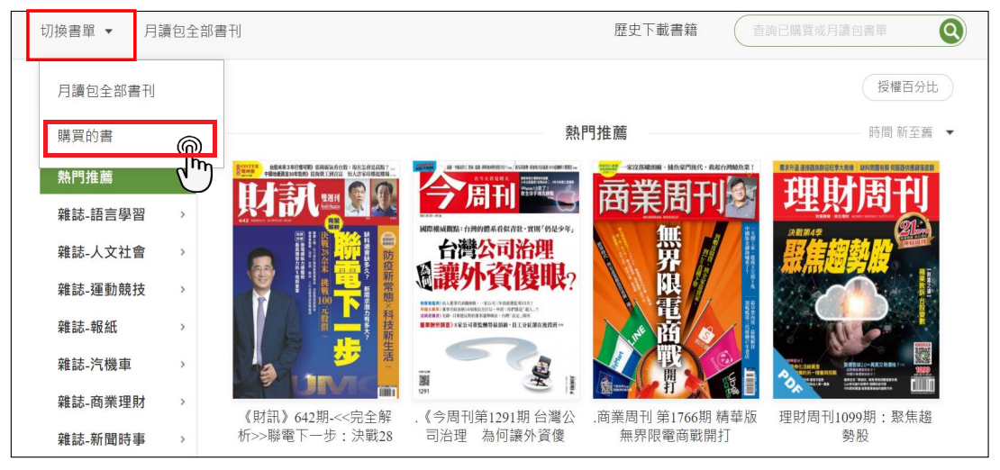
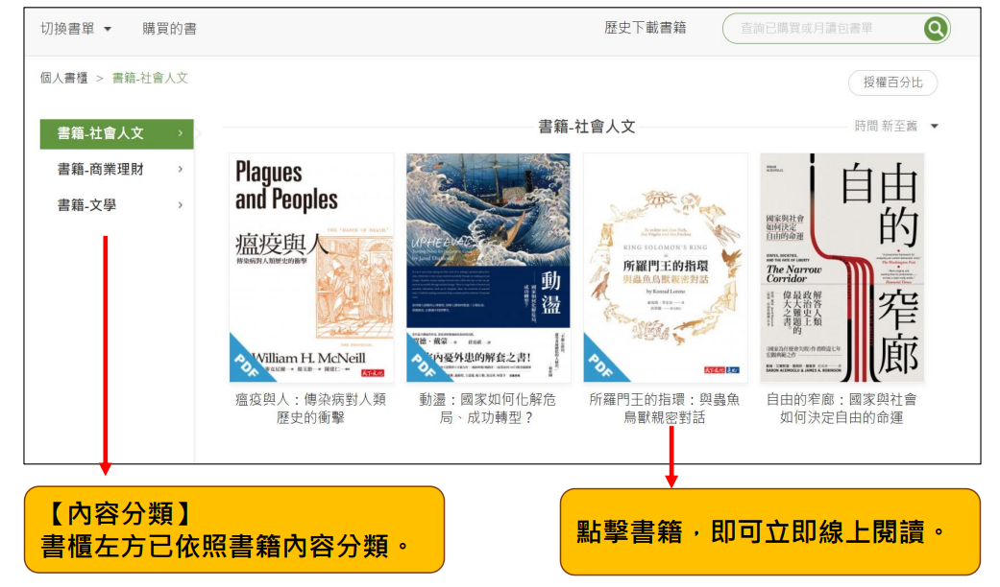
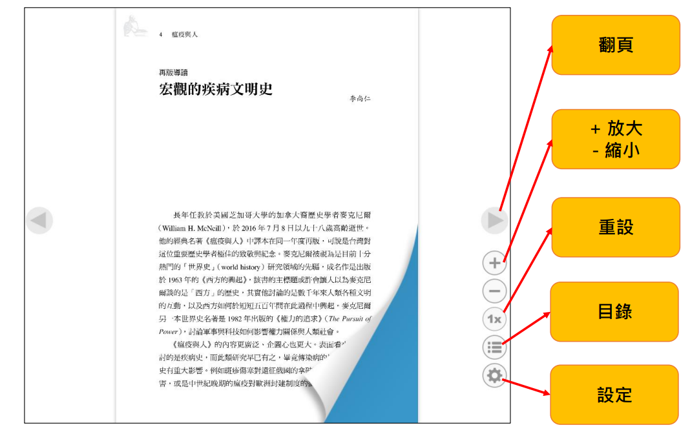
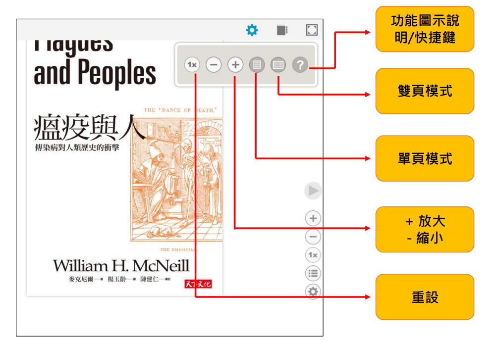
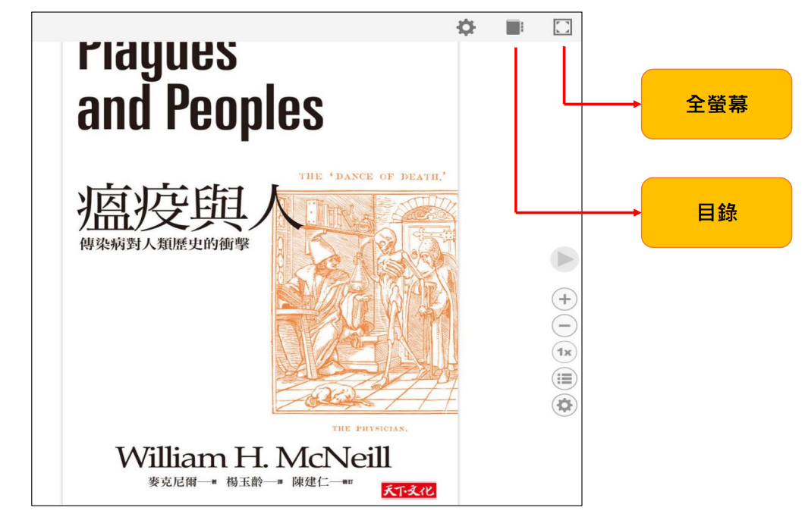

# 如何閱讀購買的書?

### HamiBookAPP閱讀

❶ 下載並開啟HamiBook APP，並請**登入購買書籍所使用的會員帳號**

❷ 選［書單］ → 將上排列表切換到［購買的書］&#x20;

&#x20;

❸ 將書單切換至［購買的書］後 → 在 **最近購買** 分類中，找到購買的書，並點擊書封。

&#x20;&#x20;

❹接著，按下右下角［下載鍵］即可開始閱讀\
&#x20;&#x20;

電子書格式：於裝置上呈現方式不同，PDF格式/ePub格式，標示於書籍簡介頁面，請於購買前確認您的購買格式。

❶PDF格式：呈現方式為圖文排列。透過HamiBookAPP閱讀版面，調整放大/縮小，如同圖片縮放功能，請以雙指放大該頁面左右滑動閱讀。於Hami書城購買PDF格式電子書，並非提供PDF電子檔案。

❷ePub格式：依據裝置不同，顯示頁面文字排列行數不同，以文字閱讀為主。HamiBookAPP閱讀版面放大/縮小，請點擊閱讀頁面，使用右下角［工具］，調整Aa［+］符號放大文字，Aa［-］符號縮小文字。

※注意事項：電子書兩項格式購買後，不受時間限制於HamiBookAPP/Hami書城官網PC閱讀。已購買之電子書內容，不受是否訂購月讀包服務影響。<mark style="color:red;">無支援另行匯出書籍電子檔案功能，亦無法使用其他程式開啟電子書閱讀</mark>。

**如何取得 HamiBook App 請見 ▶**[ **關於HamiBook閱讀器**](https://support.hamibook.com.tw/hamibookapp)

### **Hami書城官網PC閱讀**

❶進入Hami書城官網，點選右上角［登入］

<figure><figcaption></figcaption></figure>

❷ 輸入帳號密碼，登入Hami書城

<figure><figcaption></figcaption></figure>

❸點擊右上角［閱讀書籍］→［PC閱讀］

<figure><figcaption></figcaption></figure>

❹點擊左上角［切換書單］→［購買的書］

<figure><figcaption></figcaption></figure>

操作功能請參考下方圖示

※注意事項：PC閱讀，現行版本無支援塗鴉､筆記､劃線以及文字搜尋功能

<figure><figcaption></figcaption></figure>

<figure><figcaption></figcaption></figure>

<figure><figcaption></figcaption></figure>

<figure><figcaption></figcaption></figure>
