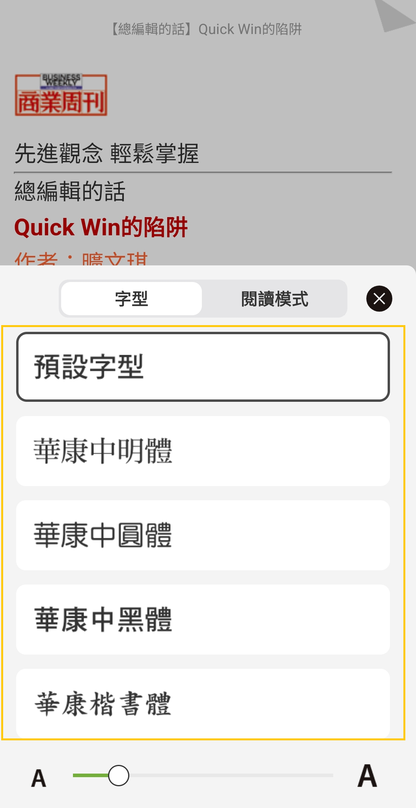
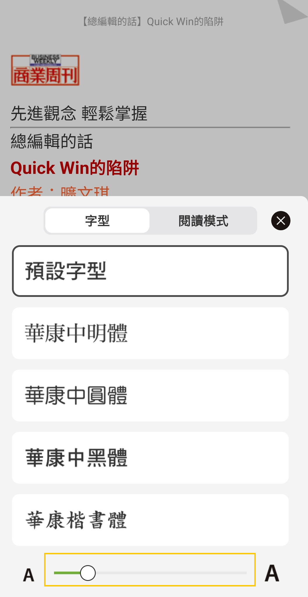
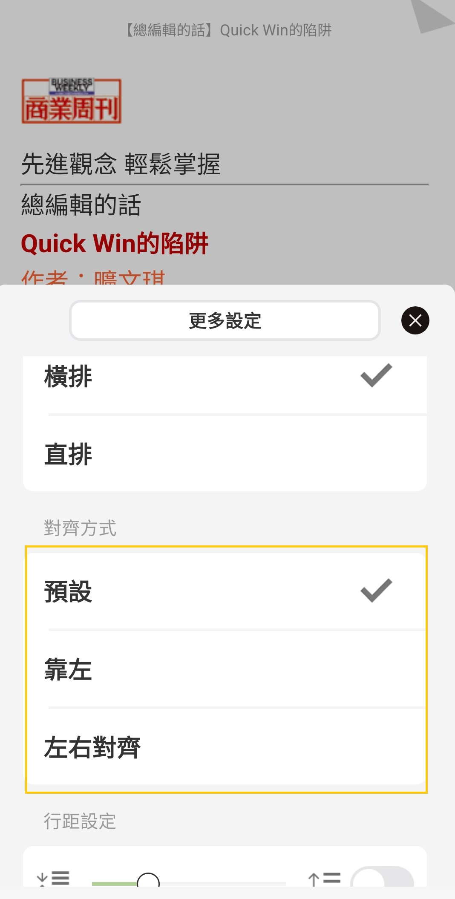
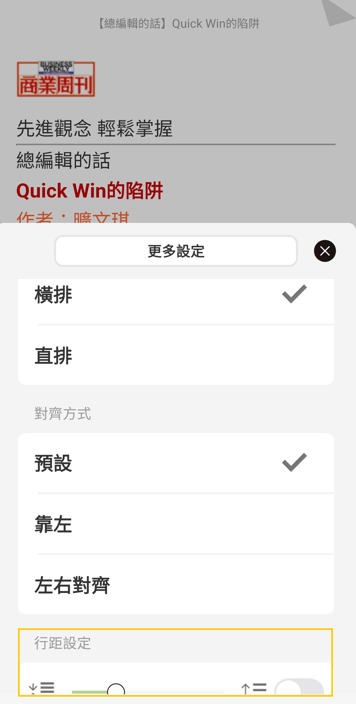

# 如何閱讀購買的書?

### HamiBookAPP閱讀

❶ 下載並開啟HamiBook APP，並請**登入購買書籍所使用的會員帳號**

❷ 選［書單］ → 將上排列表切換到［購買的書］&#x20;

&#x20;

❸ 將書單切換至［購買的書］後 → 在 **最近購買** 分類中，找到購買的書，並點擊書封。

&#x20;&#x20;

❹接著，按下右下角［下載鍵］即可開始閱讀\
&#x20;&#x20;

**如何取得 HamiBook App 請見 ▶**[ **關於HamiBook閱讀器**](https://support.hamibook.com.tw/hamibookapp)

## ePub 流動版｢個人化閱讀設定｣

ePub 流動版書籍提供用戶使用｢個人化閱讀設定｣


❶於書刊頁面，點擊閱讀中頁面將顯示｢工具列｣

<figure><figcaption></figcaption></figure>

❷點擊\[Aa]圖示，調整\[字體]

<figure><figcaption></figcaption></figure>

❸拖曳放大/縮小字體

<figure><figcaption></figcaption></figure>

❹點擊工具列右方\[...]圖示

<figure><figcaption></figcaption></figure>

4-1設定橫直排

<figure><figcaption></figcaption></figure>

4-2設定對齊方式

<figure><figcaption></figcaption></figure>

4-3行距設定

<figure><figcaption></figcaption></figure>

## **Hami書城官網PC閱讀**

❶進入Hami書城官網，點選右上角［登入］

<figure><figcaption></figcaption></figure>

❷ 輸入帳號密碼，登入Hami書城

<figure><figcaption></figcaption></figure>

❸點擊右上角［閱讀書籍］→［PC閱讀］

<figure><figcaption></figcaption></figure>

❹點擊左上角［切換書單］→［購買的書］

<figure><figcaption></figcaption></figure>

操作功能請參考下方圖示

※注意事項：PC閱讀，現行版本無支援塗鴉､筆記､劃線以及文字搜尋功能

<figure><figcaption></figcaption></figure>

<figure><figcaption></figcaption></figure>

<figure><figcaption></figcaption></figure>

<figure><figcaption></figcaption></figure>
