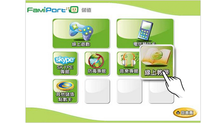
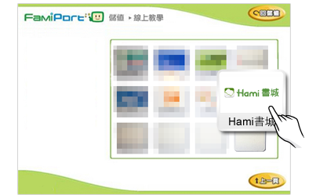
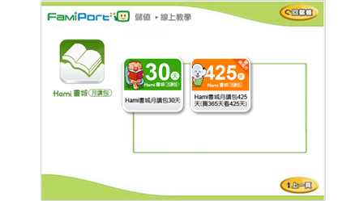
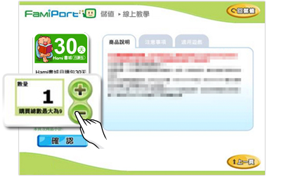
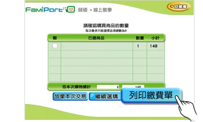
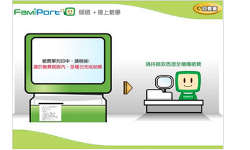

# 【全家便利商店】購買流程

❶ 至FamiPort 機台點選「儲值」。

&#x20;

❷   點選「線上教學」。

&#x20;

❸  選擇「Hami 書城月讀包」。

&#x20;

❹  點選欲購買之商品品項。

&#x20;

❺  選擇購買數量。

&#x20;

❻  確定數量，列印繳款單。

&#x20;

❼  櫃台繳費後，取得序號密碼單。

&#x20;

❽   至Hami書城官網[兌換儲值序號](https://www.hamibook.com.tw/Experiences)，兌換成功後即可使用。

&#x20;
