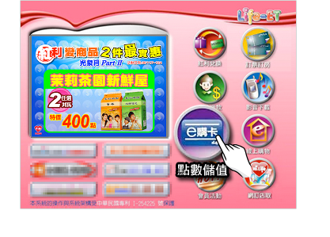
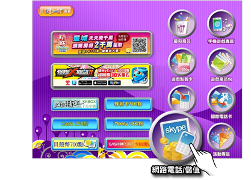
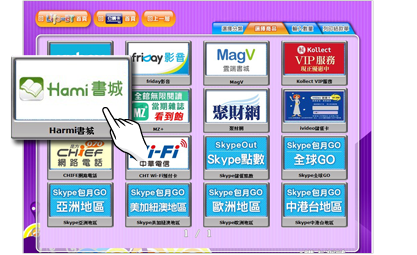
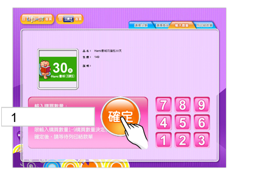
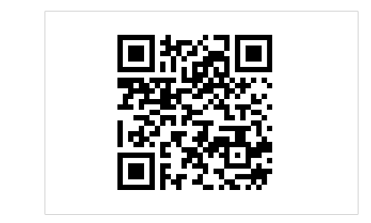

# 【萊爾富】購買流程

❶於Life-ET機台選擇「點數儲值」。

&#x20;

❷     選擇「網路電話/儲值卡」。

&#x20;

❸    選擇「Hami 書城月讀包」。

&#x20;

❹    點選購買商品品項。

&#x20;

❺    選擇購買數量。

&#x20;

❻     按下確定後，等待繳款單印出，至櫃台繳費結帳。

&#x20;

❼   至[書城官網兌換儲值序號](https://www.hamibook.com.tw/Experiences)，兌換成功後即可使用。

&#x20;
