# APP會員登入說明

❶下載Hamibook APP並登入會員。

<figure><figcaption></figcaption></figure>

❷ 登入Hamibook APP前

**Step1**

請至Hamibook APP右上方點擊「設定⚙」。

<figure>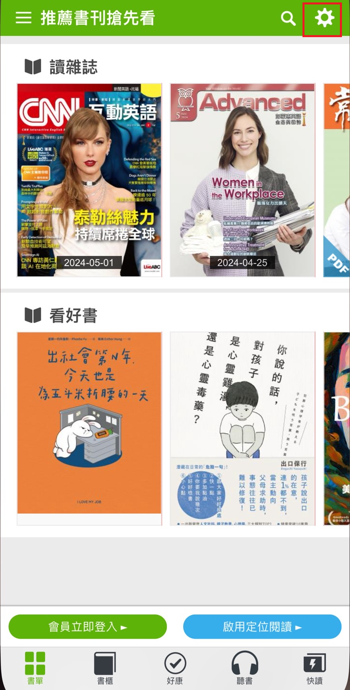<figcaption></figcaption></figure>

**Step2**

請將「中華網路自動認證」點擊「關閉」。

<mark style="color:red;">**※注意事項：因應個資安全保護升級作業，自114/5/5起，將關閉「中華網路自動認證」登入功能，以達到更安全的網路環境。**</mark>

※中華電信用戶，請參考「手機門號（簡訊驗證）」方式，以及「中華電信多元登入」方式，登入書城會員，使用Hamibook服務。\
\
\
\
​ 

<figure>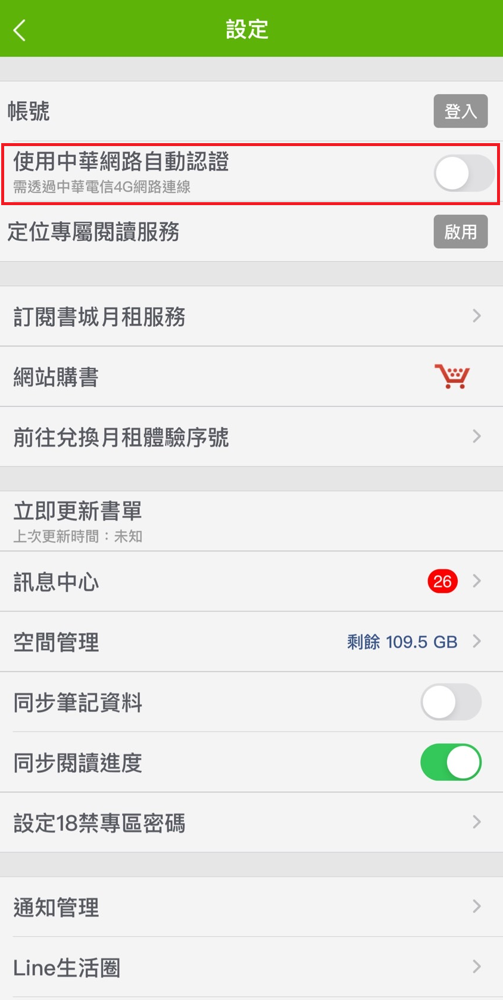<figcaption></figcaption></figure>

**Step3**

會員可參考以下方式登入

**一、中華電信手機門號登入 (簡訊驗證)**

請輸入中華電信門號帳號

<figure><figcaption></figcaption></figure>

※ 請確認中華電信手機門號需申請加入中華白金會員，加入後，才可於登入時，收取簡訊驗證碼。

※ **中華白金會員申請網址**[**https://reurl.cc/EpRDDk**](https://reurl.cc/EpRDDk)

<figure>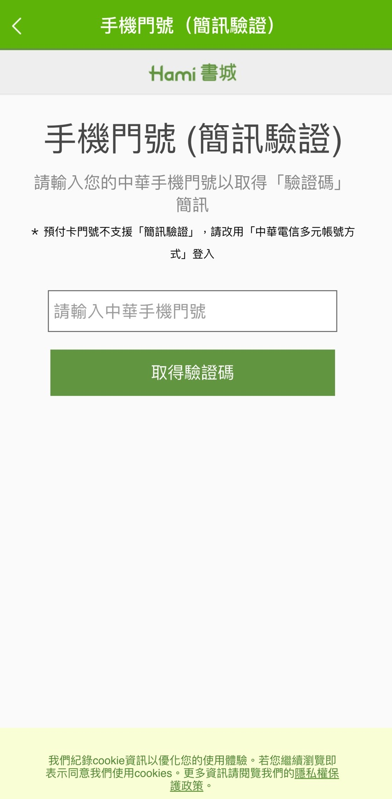<figcaption></figcaption></figure>

**二、中華電信多元登入**

請輸入中華電信多元帳號

<figure><figcaption></figcaption></figure>

<figure>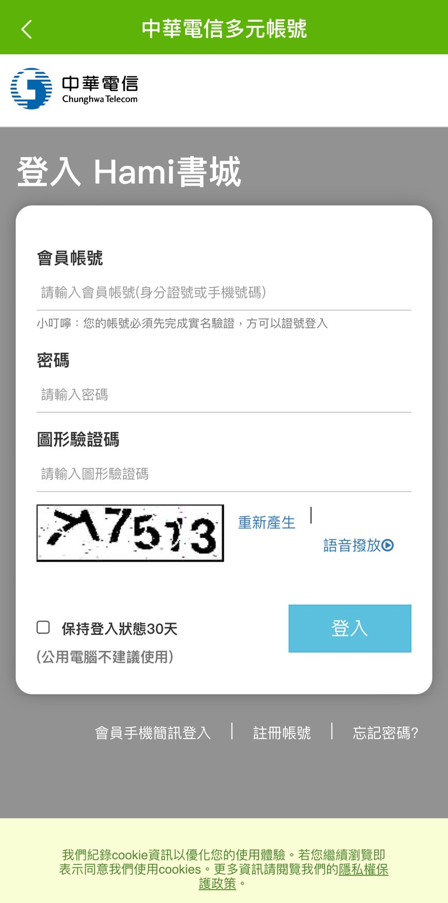<figcaption></figcaption></figure>

**三、Facebook登入**

請輸入Facebook帳號

<figure><figcaption></figcaption></figure>

<figure>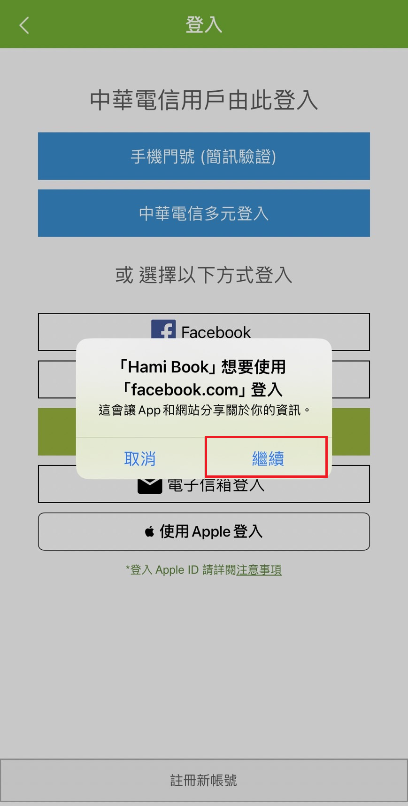<figcaption></figcaption></figure>

<figure>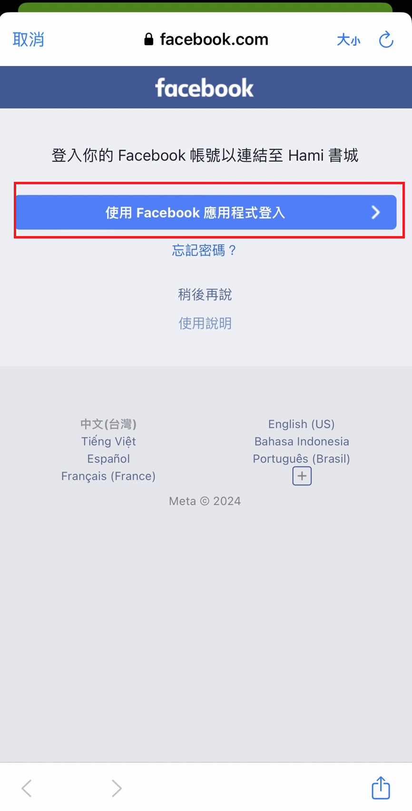<figcaption></figcaption></figure>

**四、Google登入**

請輸入Google帳號

<figure><figcaption></figcaption></figure>

<figure>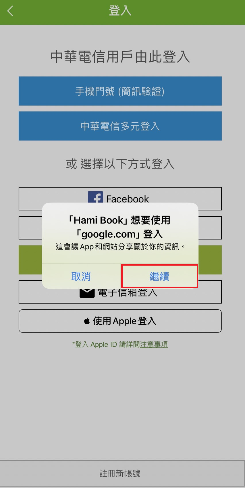<figcaption></figcaption></figure>

<figure>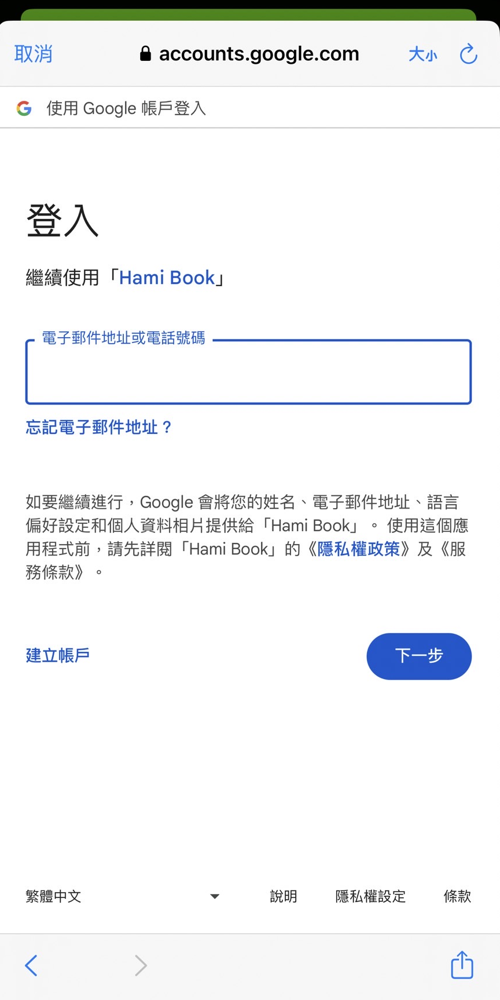<figcaption></figcaption></figure>

**五、電子信箱登入**

請輸入電子信箱帳號

<figure>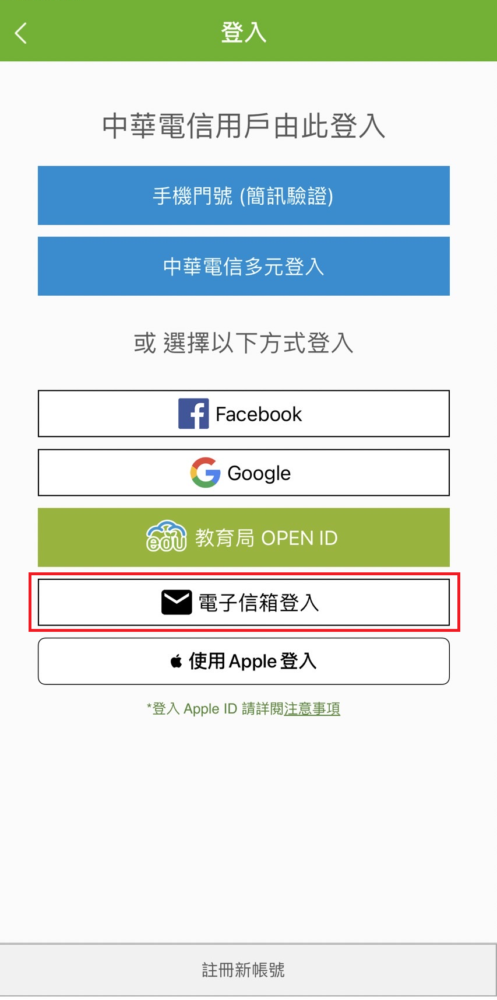<figcaption></figcaption></figure>

<figure>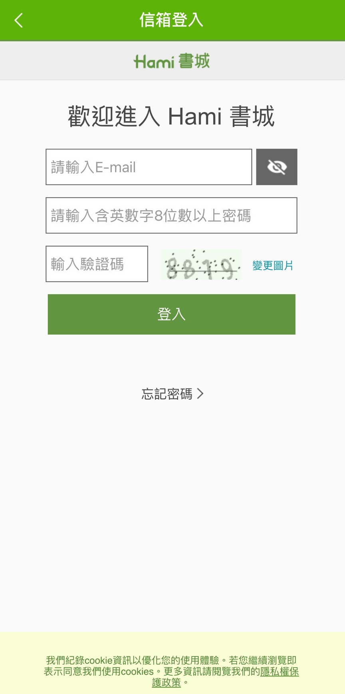<figcaption></figcaption></figure>

**六、使用Apple ID 登入**

請輸入Apple ID帳號

<figure><figcaption></figcaption></figure>

<figure>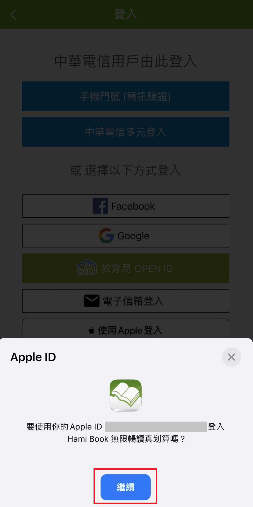<figcaption></figcaption></figure>

➌登入成功後，即可使用Hamibook APP功能。

<figure>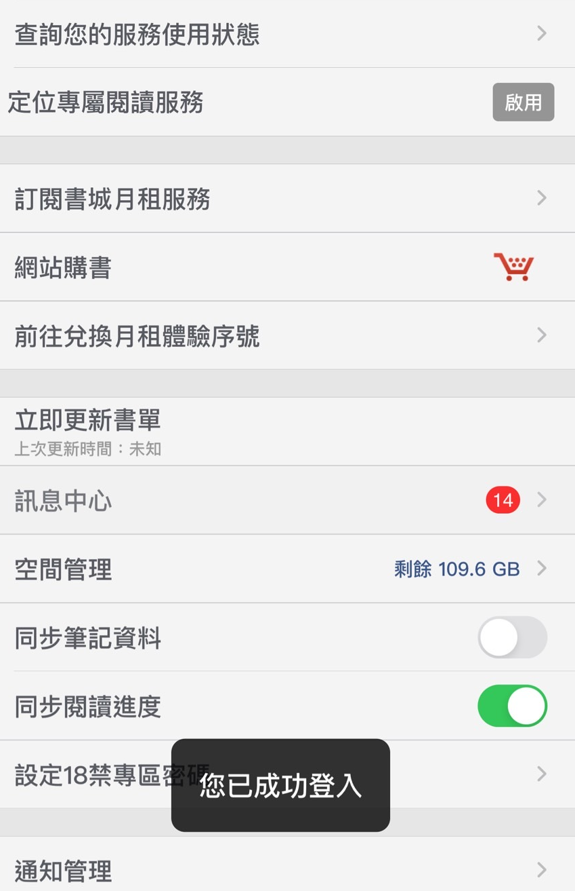<figcaption></figcaption></figure>
