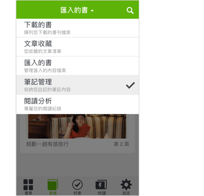
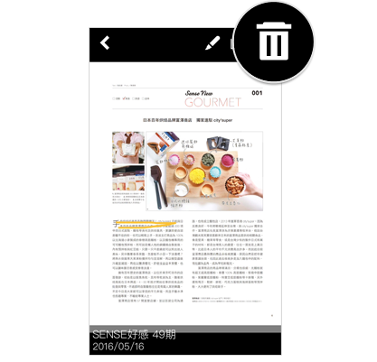
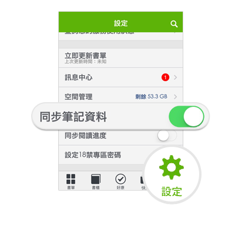
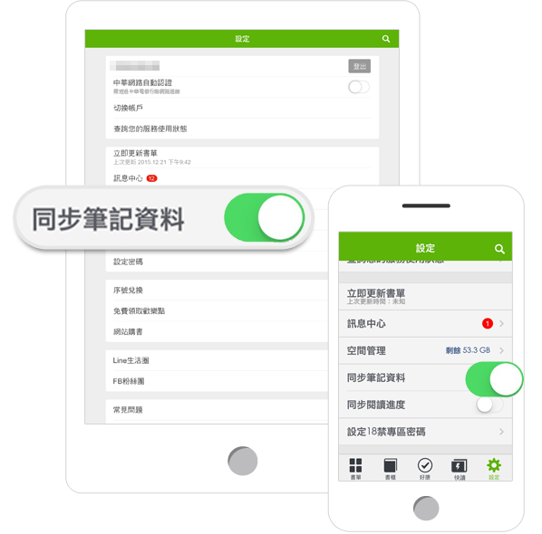
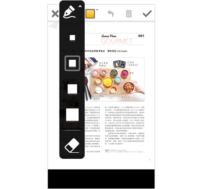
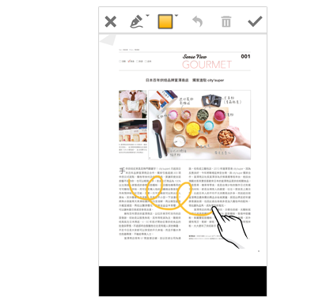
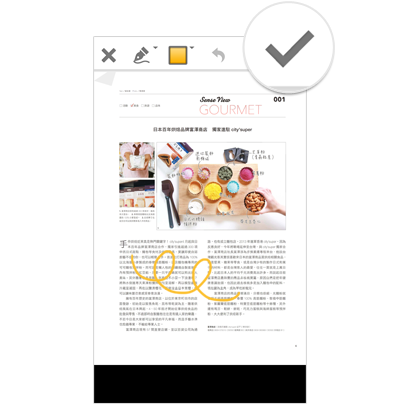
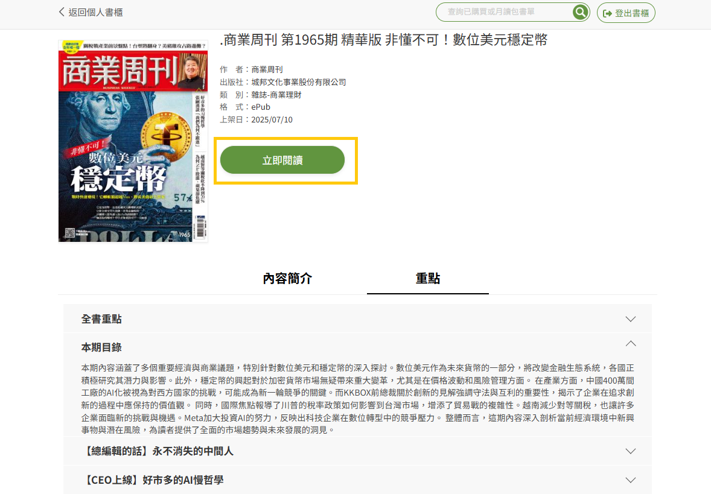

# 操作介面介紹

## 關於書單

進入「書單」您可以透過上方選單切換，任意切換至您所擁有的服務書單。進入書單後，即可下載並閱讀書單內所有的書刊。

&#x20;

若您有訂閱月讀包服務，可看見「月讀包所有書刊」選項

若您有訂閱藏愛包服務，可看見「藏愛包所有書刊」選項

若您有購買電子書，則可以看見「購買的書」選項

尚未成為月讀包會員的讀者，則可透過「編輯推薦」書單，查看免費試閱章節。

## 如何啟用「語言朗讀功能」

部份出版社針對ePub格式的書籍提供「語音朗讀」功能，用戶開啟書籍後，如左下有喇叭按鈕，即可點選播放，並非每本書籍都有朗讀功能。

**Step1**

進入書籍內容後，點擊左下方的語音鍵選擇播放功能。

<figure><figcaption></figcaption></figure>

**Step2**

點擊「 」即進行播放。點擊「  」即停止播放。

<figure><figcaption></figcaption></figure>

## 閱讀電子書時，一定要有網路連線嗎?

1. 行動裝置在每次登入及同步書單時皆須開啟網路連線，書籍自雲端下載完成後，即可離線閱讀。
2. PC 閱讀器為線上閱讀方式，故需在網路連線狀態下才可以開啟閱讀。

## 關於書櫃

進入「書櫃」，預設為「下載的書」您可以在此查看您曾下載過的書籍。切換上方選單，則可以進入 「筆記管理」､「閱讀分析」等服務畫面。

## 如何使用「筆記管理」?

**Step1**

於「書櫃」專區選擇「筆記管理」，可檢視曾做過塗鴉、書籤的刊篇章。

<figure><figcaption></figcaption></figure>

**Step2**

點選上方的垃圾筒圖示可選擇刪除筆記。

<figure><figcaption></figcaption></figure>

**Step3**

選擇鉛筆圖示可輸入其他註解。

<figure><figcaption></figcaption></figure>

**Step4**

選擇書本圖示會自動跳回原書籍。

<figure><figcaption></figcaption></figure>

## 如何「同步筆記資料」?

**Step1**

首先就是要打開同步功能，不管是 Android、iOS、手機或是平板，請到「設定」→同步筆記功能(預設關閉)，將功能開啟。

<figure><figcaption></figcaption></figure>

**Step2**

接下來將要同步筆記的裝置一樣到設定→開啟同步筆記功能。

<figure><figcaption></figcaption></figure>

**Step3**

筆記即可在另一裝置同步。

## 如何「同步閱讀進度」?

**Step1**

請到設定→同步閱讀進度，將功能開啟(預設關閉)。

**Step2**

接下來將要同步閱讀進度的裝置一樣到設定→開啟同步閱讀進度功能。

**Step3**

在已開啟同步的裝置上閱讀書籍時即會自動同步至上次的閱讀進度。

## 如何使用「塗鴉」?

**Step1**

請於書籍閱讀頁面點擊螢幕，右下方顯示工具列圖示:工具､塗鴉､書籤､快速翻頁､目錄，使用塗鴉筆記功能。若未顯示，即此書籍並未支援塗鴉功能。

選擇想要塗鴉的頁面，點擊畫面中央或點選右下角「⋯」圖示，選擇「塗鴉」。

<figure><figcaption></figcaption></figure>

**Step2**

按下「塗鴉」，會跑出塗鴉工具列。

<figure><figcaption></figcaption></figure>

**Step3**

塗鴉功能可以選擇筆的粗細和橡皮擦。

<figure><figcaption></figcaption></figure>

**Step4**

再來就是使用你的手指(或是觸控筆)，在頁面上盡情地發揮創意！

<figure><figcaption></figcaption></figure>

**Step5**

完成創作之後，按一下右上角的勾勾就會自動儲存。

<figure><figcaption></figcaption></figure>

## 關於好康

❶請開啟HamiBookAPP下排工具列［好康］>［好康活動］查看當期活動列表。

❷若有參加活動之得獎通知，將透過［好康］>［我的獎勵］發送獎勵通知。

## 聯絡客服人員

請您透過HamiBookAPP > 右上角［設定］> ［聯絡我們］，將｢您的問題｣、｢書籍名稱及期數｣、｢發生問題的截圖畫面｣轉發書城客服信箱（此方式會記錄您裝置的登入資訊），客服中心將協助您進行確認。

**電腦版PC線上閱讀**

❶點擊右上方｢登入｣月讀包會員帳號，登入後，點擊｢閱讀書籍｣>｢PC閱讀｣。

<figure><figcaption></figcaption></figure>

❷部分刊物提供全書｢重點｣。

<figure><figcaption></figcaption></figure>

❸點擊｢立即閱讀｣開啟閱讀。

<figure><figcaption></figcaption></figure>

❹閱讀結束後，點擊｢登出書櫃｣。

<figure><figcaption></figcaption></figure>

