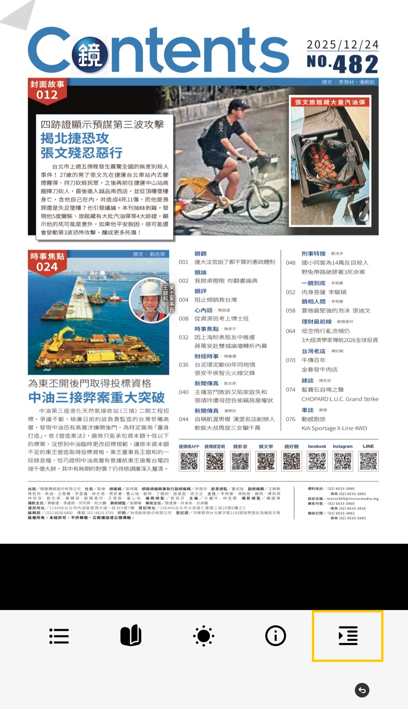

# iPad以及iPhone單頁放大頁面閱讀翻頁設定

敬請用戶於HamiBookAPP進行以下操作步驟設定

❶請用戶開啟HamiBookAPP，於閱讀中的頁面，點擊頁面，開啟\[工具列]，右下方\[排版設定]圖示

<figure><figcaption></figcaption></figure>

❷滑至此\[排版設定]頁面最下方，將\[翻頁效果]設定勾選為\[滑動翻頁]

<figure><figcaption></figcaption></figure>

➌設定後，重新開啟書刊/報紙閱讀
