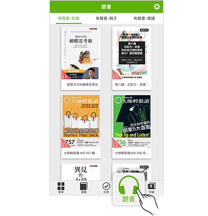
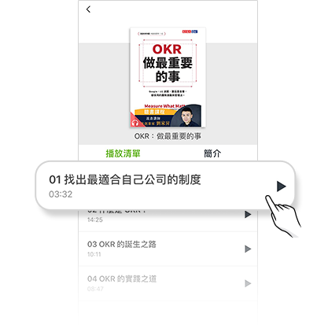
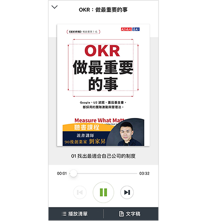

# 如何使用「聽書」(有聲書)功能

## 如何開始使用「聽書」(有聲書)功能?

❶  開啟APP選擇下方「聽書」，並從上方選擇分類

&#x20;

❷  向下滑動可看見更多內容，選擇喜好的內容點擊進入

&#x20;

❸  可查閱撥放清單及簡介，點選章節即可開始撥放音檔

&#x20;

❹  撥放進行中畫面上有撥放器可選擇暫停/繼續/下一段/上一段 等功能。

&#x20;

## 聽書功能於背景模式無法持續播放，該如何解決？

聽書功能，可於背景撥放，但Android作業系統，因為內建有 Google Doze 省電模式，並會在行動裝置螢幕關閉一段時間後，限制背景傳輸資料並將網路中斷，造成聽書功能無法持續播放。

欲改善此情況，請將Hami書城App加入省電模式白名單，即可解決忽然關閉或停止播放的問題。

### Android Doze 省電模式的白名單設置方式&#x20;

以下以 Samsung 系列手機，提供設定步驟參考：

1. 設定
2. 電池
3. 電池使用狀況
4. 查看更多
5. 最佳化電池用量
6. 應用程式最佳化 (這裡所謂的「應用程式未最佳化」，就是 Doze 省電的「白名單」，官方的 App 預設也有加入，使其不受到省電模式影響)
7. 所有應用程式
8. 找到「Hami書城」並將選項開啟
9. 最後到「應用程式未最佳化」檢查「Hami書城」也成功設置在白名單當中

各家Android系統手機設定方式可能不盡相同，請透過手機操作手冊或官網教學說明進行設定。
