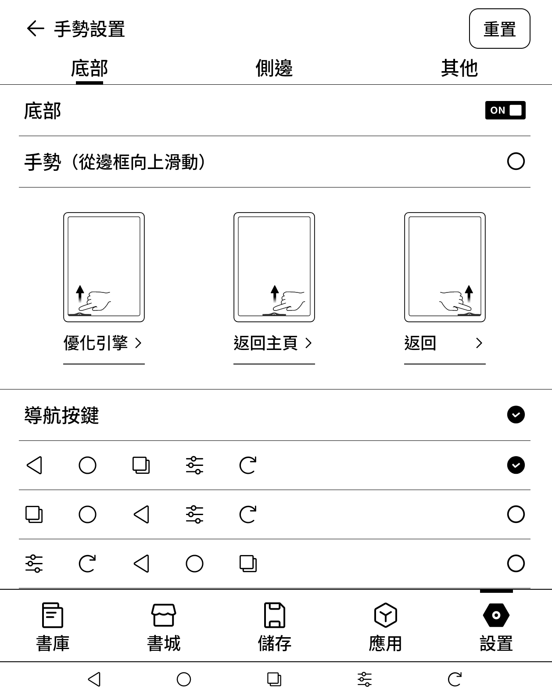
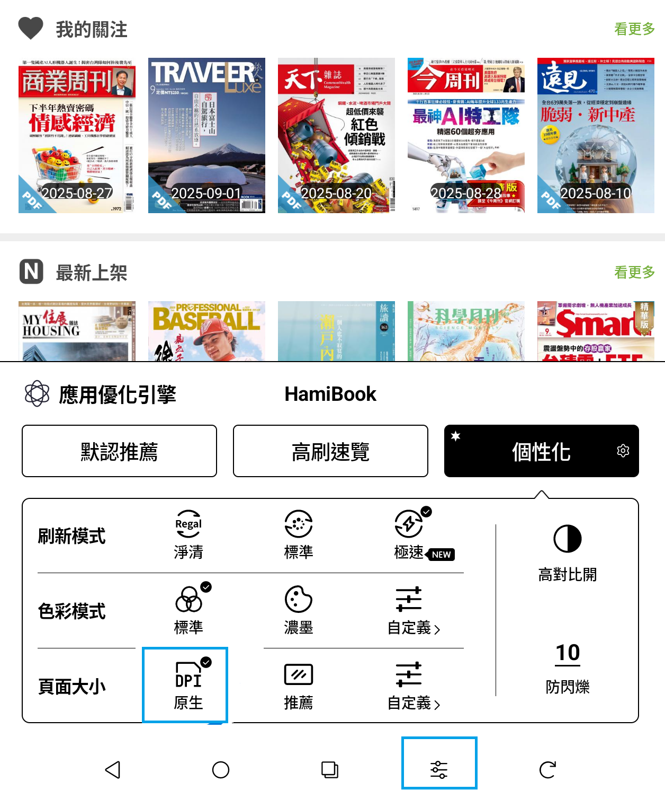

# 文石BOOX閱讀器應用程式個性化設定

用戶使用文石BOOX閱讀器，請調整以下設定，即可正常顯示 Hami書城內的數位書刊顯示比例。

步驟一：請先確認已開啟導航按鍵

開啟導航按鍵：設置>手勢設置>導航按鍵 勾選

<figure><figcaption></figcaption></figure>

<figure><figcaption></figcaption></figure>

步驟二：設定「應用程式個性化」改善頁面大小呈現問題

首先開啟 Hami書城應用程式
\
點選「導航按鍵」的設定鈕，展開個性化設定畫面
\
於「頁面大小」勾選 「DPI 原生」

<figure><figcaption></figcaption></figure>

設定後，正常顯示 Hami書城內的數位書刊顯示比例。
