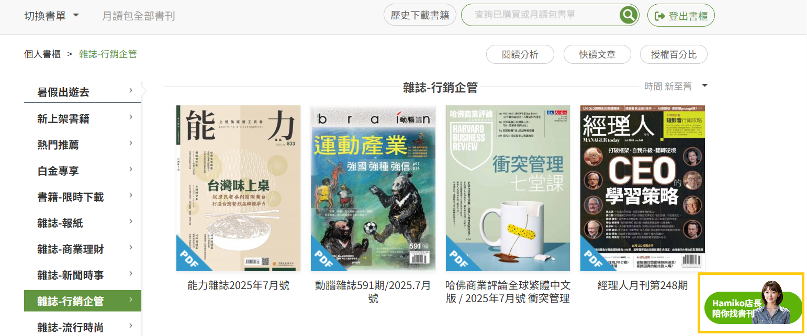

# 關於 Hamiko 店長

開啟方式

❶HamiBookAPP｢書單｣首頁右下方｢Hamiko店長｣功能選單

<figure><figcaption></figcaption></figure>

❷HamiBookAPP｢書單｣､｢書櫃｣右上方，｢搜尋｣功能（放大鏡圖示）

<figure><figcaption></figcaption></figure>

❸電腦版Hami書城官網首頁，｢登入｣會員帳號後，右下方顯示｢Hamiko店長｣功能選單

<figure><figcaption></figcaption></figure>

<figure><figcaption></figcaption></figure>

❹電腦版個人｢書櫃｣頁面

<figure><figcaption></figcaption></figure>
