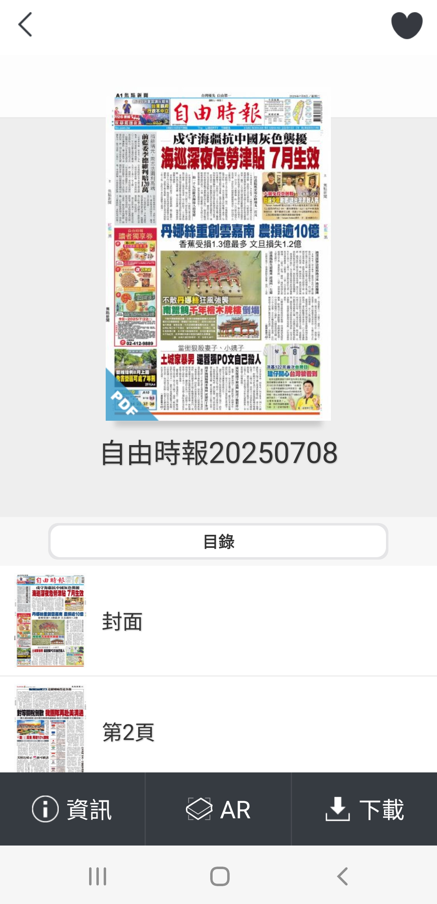
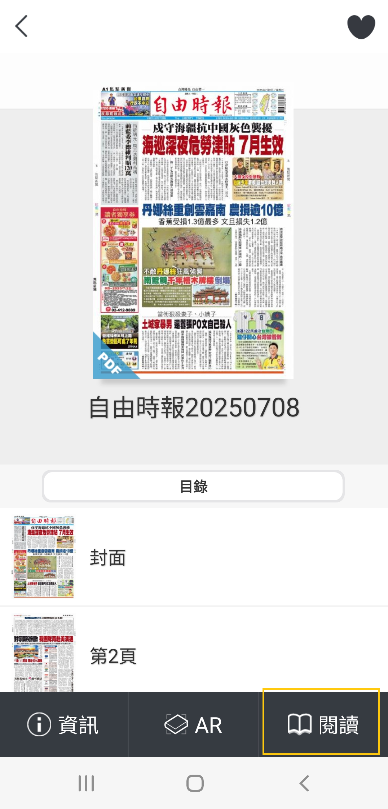
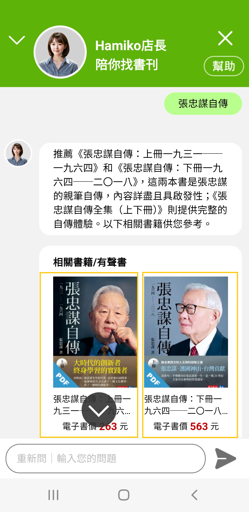
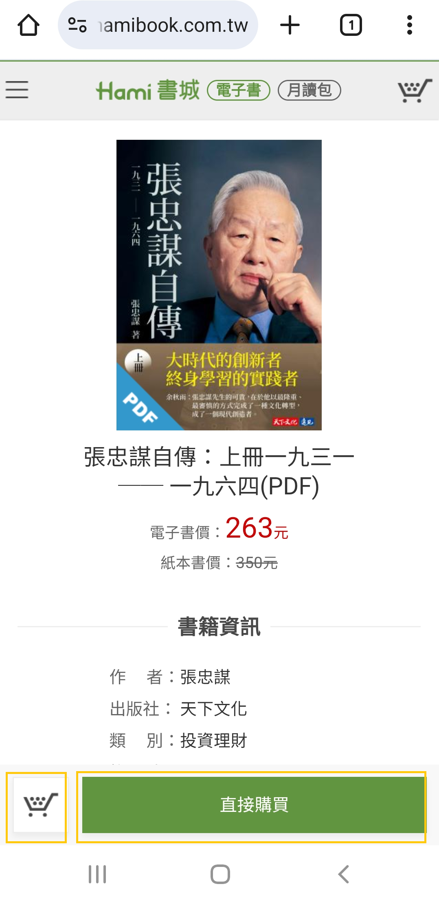

# 如何找書

如何找書？

一.月讀包架上書刊/報紙，找書後，已付費訂閱月讀包讀者，無須另行付費購買。

❶ 於｢Hamiko店長｣功能選單，輸入您欲找尋的書刊､報紙名稱，例如：自由時報。

<figure><figcaption></figcaption></figure>

<figure><figcaption></figcaption></figure>

❷顯示相關書刊/報紙

月讀包書刊/報紙：月讀包會員，可點擊報紙封面圖示。

<figure><figcaption></figcaption></figure>

❸開啟報紙目錄頁面。

❹點擊右下方｢下載｣按鈕，下載後開啟｢閱讀｣。

<figure><figcaption></figcaption></figure>

<figure><figcaption></figcaption></figure>

二.單本電子書購買，提供讀者付費選購，購買後即可於Hami書城閱讀，<mark style="color:blue;">**本網站商品均為電子書，無提供紙本實體書**</mark>。

❶ 於｢Hamiko店長｣功能選單，輸入您欲找尋的書籍名稱，例如：張忠謀自傳。

❷顯示相關書籍，點擊書籍封面圖示。

<figure><figcaption></figcaption></figure>

❸開啟｢書籍資訊｣購買頁面。

❹點擊｢直接購買｣，或者左方｢放入購物車｣圖示，繼續選購其他書籍。

<figure><figcaption></figcaption></figure>

