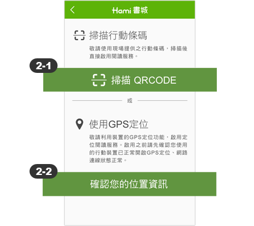
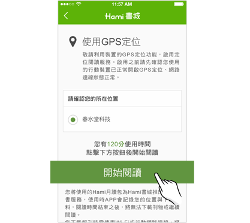
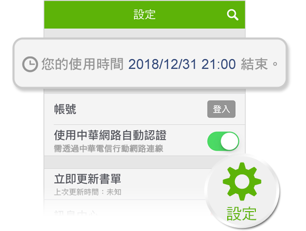

# 關於定位閱讀

## 我是讀者，如何使用場域閱讀

**※ 使用場域閱讀服務之前，請確認您的行動裝置已開啟GPS定位功能，並且網路連線狀態正常。**

啟用書城定點閱讀服務之前，您需先下載並安裝HamiBook App，開啟App後，選擇「啟用定點閱讀」服務，並允取存取裝置的位置資訊，即可進入畫面查看您目前所在場所是否有提供服務。

### 如何啟用定點閱讀服務？

`※行前提要：使用GPS定位閱讀，需請您授權裝置中的定位資訊，僅用於確定您當時所在的場所能否提供閱讀服務，不會紀錄或保留您的個人資料。使用行動條碼啟用時，需要請您授權裝置的相機功能，才能掃描條碼啟動閱讀服務，不會紀錄或存取您的圖片相關資料。 您亦可以利用裝置本身的設定，調整與修改您所給予HamiBook的存取授權。`

❶開啟Hami書城後，請點選啟用定位閱讀&#x20;

&#x20;

❷選擇啟用服務的方式，有兩種選擇：

&#x20;

#### 2-1掃描行動條碼

若您於合作場域閱讀服務的場所，有看到 Hami書城的閱讀海報或立牌，可以選擇掃描上面的QRCode，直接就可登入使用本服務。

**2-2使用GPS定位**

**兩種方式進入後都會顯示你目前所在地置的合作夥伴名稱，請選擇場域名稱後，點選開始閱讀。即可開始閱讀所有書刊雜誌。**

&#x20;

### 每次可閱讀多少時間？

每個場域的開放時間不一定，您可從APP「設定］選項查看目前剩餘時間。

&#x20;

### 使用時間結束後，可以繼續閱讀嗎？

當定點閱讀服務使用時間結束，您可以選擇「登入成為Hami書城新會員」，獲取新會員免費使用天數，或直接訂閱Hami書城月讀包服務。

### 請問有哪些地方與場所提供定點閱讀服務呢？

Hami書城與各界合作夥伴提供您優質閱讀服務，您可利用以下連結前往確認各服務據點位置。[前往瀏覽服務合作據點▶](https://www.hamibook.com.tw/LBS/companies)

### 我在提供服務的場域內，但無法正常登入？

請依以下步驟確認您的地理座標位置是否正確。&#x20;

1. 關閉 HamiBook App
2. 開啟 Google map 確認自已是否正在現在的場域，按下右下角的「定位」來協助定位。
3. 重新開啟 HamiBook App，登入服務。

### 我看不到「啟用定位閱讀服務」選項

請確認您是否已經登入書城服務，定位閱讀需以您的裝置座標進行登入，若您目前是會員登入狀態，請先登出您的書城會員帳號。

1. 點擊App右上角「設定⚙」&#x20;
2. 查看是否已登入。若是，請登出，並關閉「中華網路自動認證」
3. 並於設定畫面啟用「定點專屬閱讀」選項

### 出現網頁無法使用畫面

**請先確認您的網路連線(3G/4G/Wi-Fi)是否已經開啟。**&#x82E5;已開啟，請進入「設定⚙」畫面，點選最下方的「聯絡我們」，透過郵件來信書城客服信箱，以利我們瞭解您的裝置資訊，以便查核原因。

### 登入「啟用定位閱讀服務」選項後，立即跳出閱讀時間已結束訊息？

請檢查您手機/平板的日期與時間，是否設定為目前的時間，並檢查時區是否為台灣時區？若不是，**請選擇「自動設定日期與時間」**，即可正常使用本服務。

### 如何增加定位準確度

本服務使用定位方式來確認您的位置是否提供此服務，大部分的定位不準確為您的裝置對目前的所在位置有所誤差，您可藉由以下方式來增加定位的準確度，以順利使用本服務。&#x20;

1\. 暫時開啟Wi-Fi功能(不用連結)，增加定位的準確度。 \
2\. 開啟Google map，按下右下角「定位」來協助定位。\
&#x20;3\. 關閉並再次開啟定位功能(Android)。

### 使用時若有疑問或建議可以如何詢問呢？

您可以依以下時間聯絡客服人員詢問相關事宜

☎ 聯絡電話：0800-007-368 \
時間：週一至週五（不含國定假日/例假日）09:30-12:30、13:30-17:30

## 我是場域商家，如何申請場域閱讀服務

場域閱讀是 Hamibook 獨家技術，透過GPS定位模式可提供特定區域範圍的用戶免註冊，即可登入Hami書城月讀包，享受無限閱讀服務。請至企業服務專頁填寫聯絡資料，我們將由專人為您服務。

[詳見Hami月讀包企業服務說明 ▶](https://www.hamibook.com.tw/Homes/action/1/1021)
