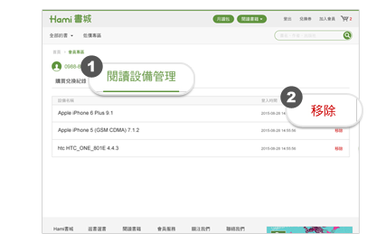

# 月讀包暢讀服務介紹

## 台灣五大報紙、超過180刊主流雜誌 

「月讀包」架上書刊有聯合報、自由時報、中國時報、經濟日報、工商時報、天下雜誌(精華版)、商業周刊(精華版)、今周刊(精華版)、鏡周刊、康健雜誌、動腦、數位時代、儂儂Bella、VOGUE、GQ……等180刊。

[詳見月讀包所有書刊分類▶](https://www.hamibook.com.tw/Stores/month/PKG_10001/111000/new_desc/0/magazine/business)

> ### 月讀包內報紙、雜誌授權比例？
>
> 月讀包內容因各家版權授權比例不同，故電子雜誌與實體雜誌有些許差異(包含但不限於：外文版權授權範圍、廣告頁、 編輯方式……等差異)，其差異視各家出版社授權百分比而定，以實際品項為主，非全部上架之刊物皆為100%授權。
>
> [詳細內容請參見月讀包「授權百分比」▶](https://www.hamibook.com.tw/Months/percent)

## 週週更新「限時下載」暢銷書

月讀包會員目前除了暢讀最新出刊的報紙、雜誌外，每月可額外享有20本以上「限時下載」電子書，此區的書籍是特別與出版社爭取合作之書刊，於活動期間內月讀包會員均可下載閱讀，內容比例為100%。

[詳見月讀包每月限時下載活動網頁▶](https://www.hamibook.com.tw/Homes/action/1/253)

## 無限暢聽「聽書」服務

月讀包會員於服務期間，亦可無限享有HamiBook App「聽書」單元。內有超過500個有聲知識，包含大師導讀、有聲書、兒童有聲學習、語言學習、職場知識等。

## 如何管理閱讀設備？

當您成為月讀包會員後，一組帳號可支援5台裝置，系統會自動將月讀包全部書刊上架至「書單」中，只要開啟裝置，即可下載並於付費期間持續閱讀。**但若於非付費期間，曾下載的雜誌書籍檔案，將會無法開啟閱讀。**

一個帳號能註冊5台不同的裝置，您可自行至會員專區管理使用的裝置。

[前往管理設備▶](https://auth.kollect.com.tw/?app=hbook\&she-key=026c97b184cbbe1bfeac9dfdd1d6abf9e5b867de\&ga=478782984.1695283551#/equipment)

&#x20;
