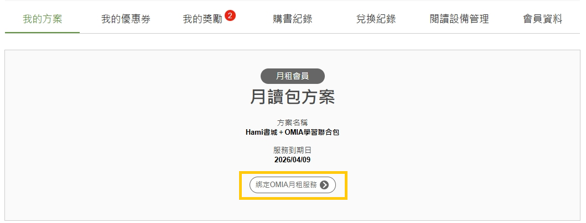
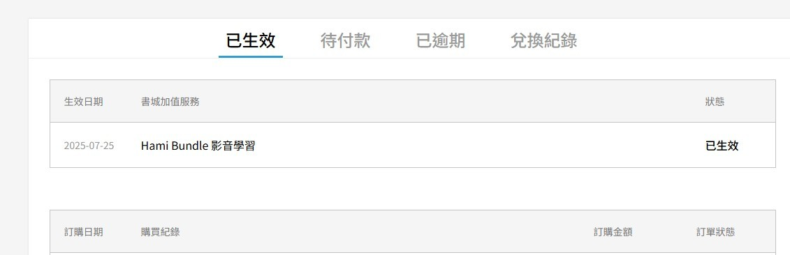

# 關於學習聯合包方案

用戶申租方案：Hami書城+OMIA學習聯合包

帳號綁定設定方式：

❶請於Hami書城電腦版官網[https://www.hamibook.com.tw/Homes/book](https://www.hamibook.com.tw/Homes/book)

｢登入｣申租方案之Hami書城會員帳號→前往｢會員專區｣→｢我的方案｣

❷點擊｢綁定OMIA月租服務｣

<figure><figcaption></figcaption></figure>

❸點擊後，將前往OMIA官網[https://www.omia.com.tw/](https://www.omia.com.tw/)

進行｢註冊/登入｣→登入後，選擇帳號綁定

❹綁定成功，點選OMIA｢會員頭像｣→｢訂單/兌換紀錄｣→顯示｢Hami Bundle影音學習｣已生效

<figure><figcaption></figcaption></figure>
