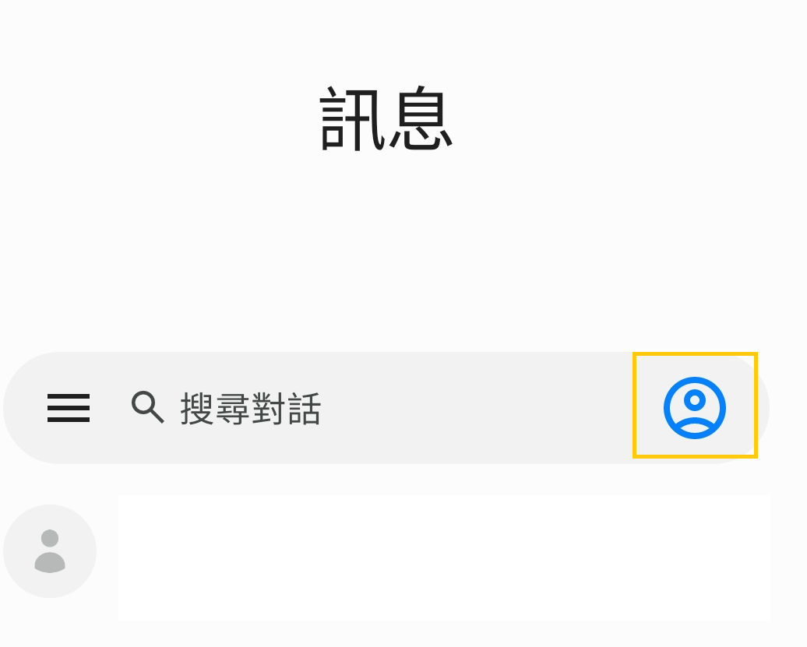
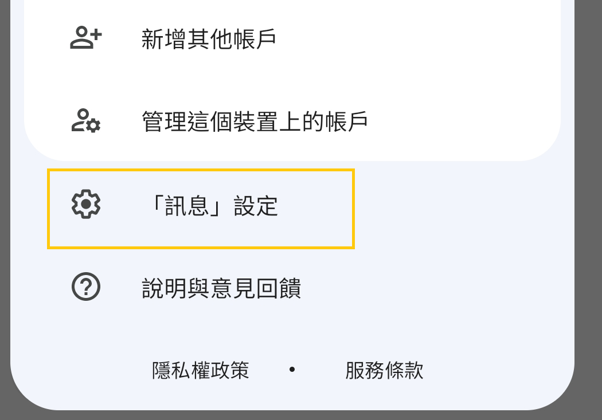
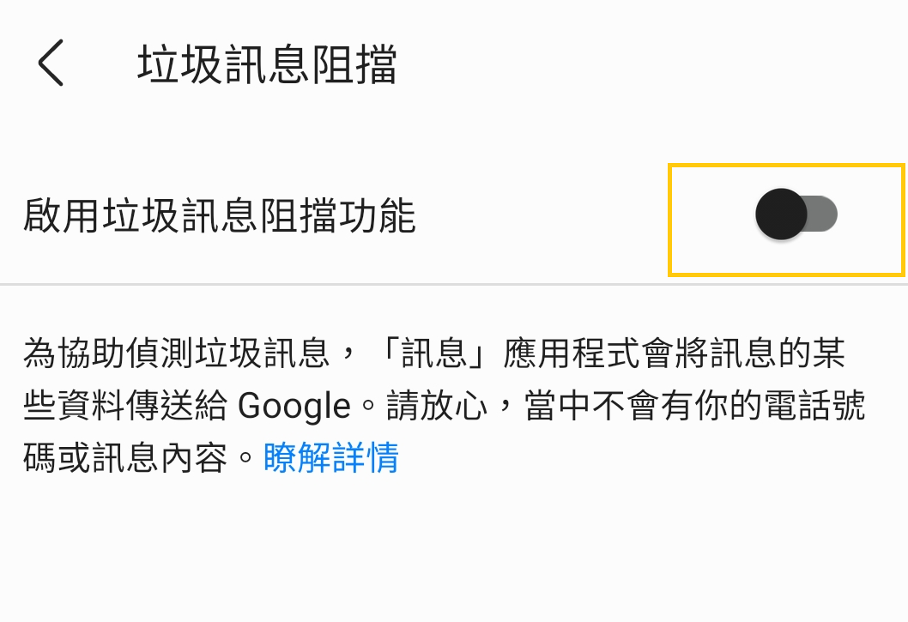
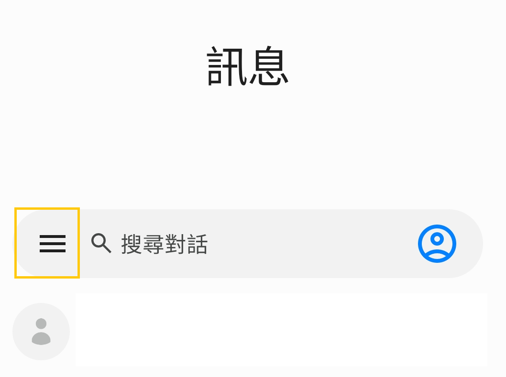
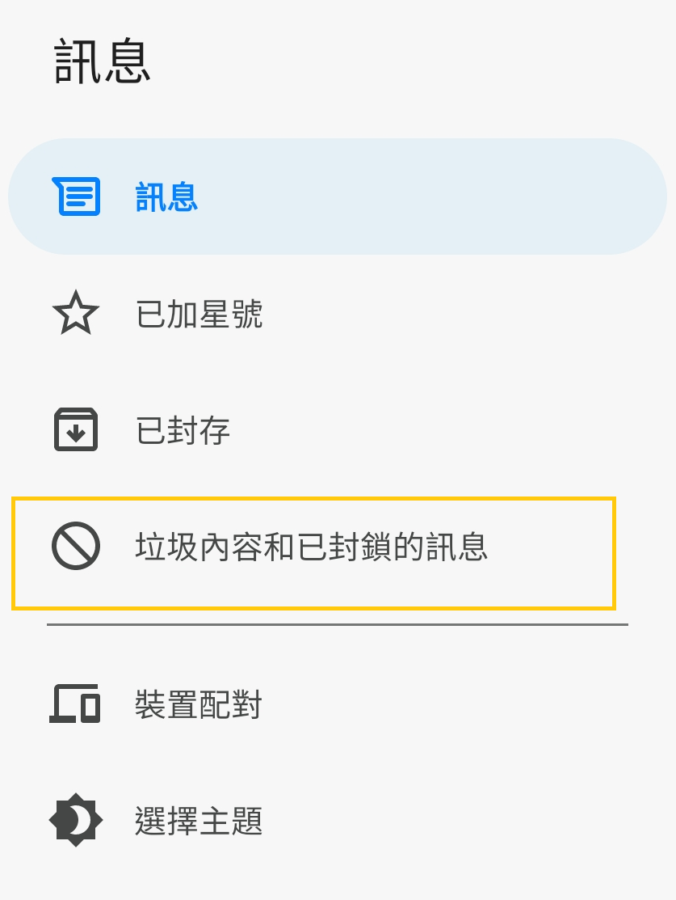
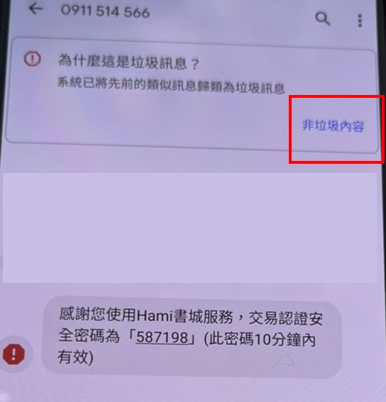

# 會員參與活動收取簡訊驗證碼說明

操作流程

步驟一：請開啟裝置內「訊息」功能

步驟二：點擊右上方「人頭」

<figure><figcaption></figcaption></figure>

步驟三：點擊「訊息」設定

<figure><figcaption></figcaption></figure>

步驟四：點擊「垃圾訊息阻擋」

<figure><figcaption></figcaption></figure>

步驟五：「啟用垃圾訊息阻擋功能」請點擊「關閉」

<figure><figcaption></figcaption></figure>

步驟六：請至「訊息」功能左上方點擊「三條橫線」符號

<figure><figcaption></figcaption></figure>

步驟七：點擊「垃圾內容和已封鎖的訊息」

<figure><figcaption></figcaption></figure>

步驟八：請將門號0911514566點擊「非垃圾內容」

<figure><figcaption></figcaption></figure>

步驟九：請於活動頁面，點擊發送驗證碼，點擊「訊息」功能，正常收取驗證簡訊。

補充說明：Google關於Android裝置封鎖垃圾訊息的說明https://support.google.com/messages/answer/9061432?hl=zh-Hant

