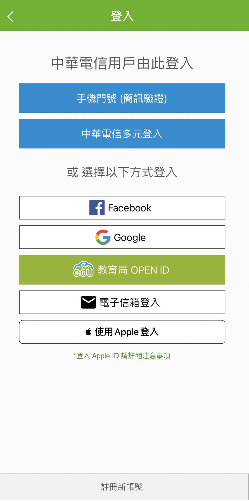
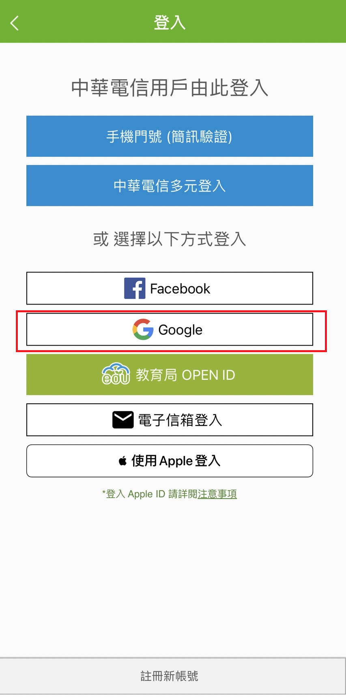
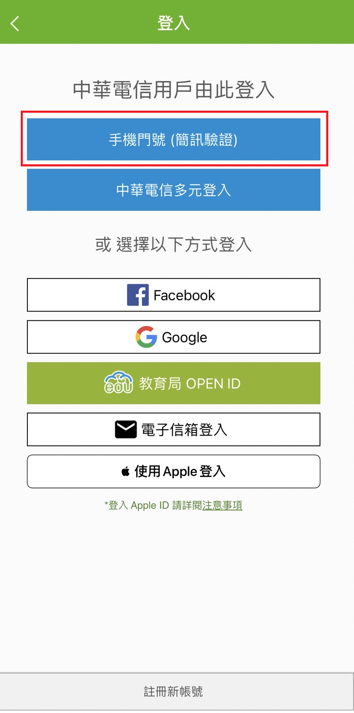
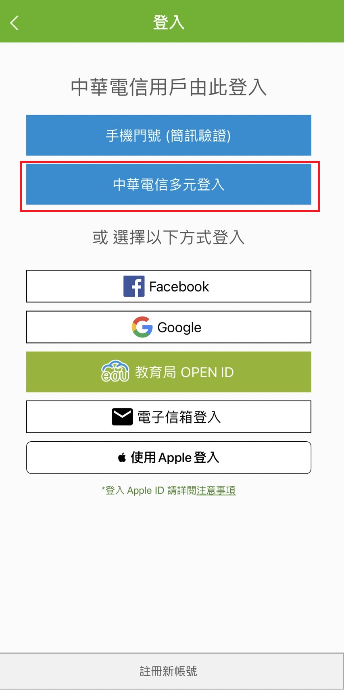
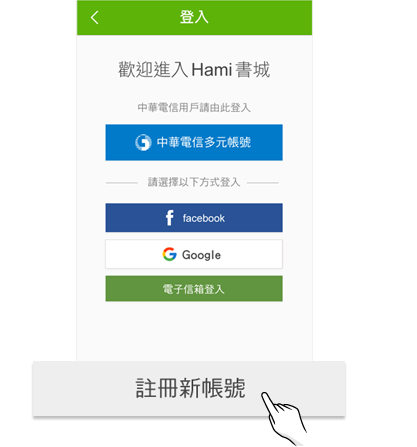
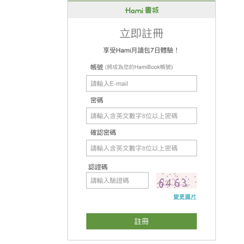

# 會員登入與註冊指引

## Hami書城登入畫面

<figure><figcaption></figcaption></figure>

## 社群帳號登入選擇

### Facebook

<figure><figcaption></figcaption></figure>

### Google

<figure><figcaption></figcaption></figure>

### Apple ID

<figure><figcaption></figcaption></figure>

## 中華電信帳號登入

選擇中華電信帳號登入者，需先成為「中華電信會員」（中華電信門號用戶亦需要前往中華電信官網，確認是否已登入成為會員）\
🔗  [https://my.cht.com.tw/](https://my.cht.com.tw/)

### 中華電信門號

<figure><figcaption></figcaption></figure>

### 中華電信多元帳號

<figure><figcaption></figcaption></figure>

## 註冊與電子信箱認證

於登入畫面最下方，點選「註冊新帳號」

&#x20;

&#x20;

